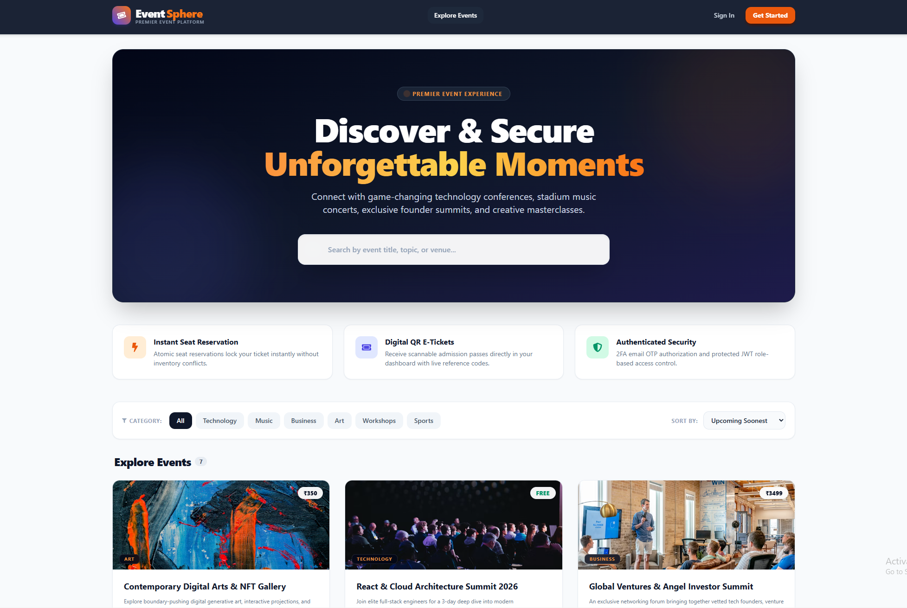
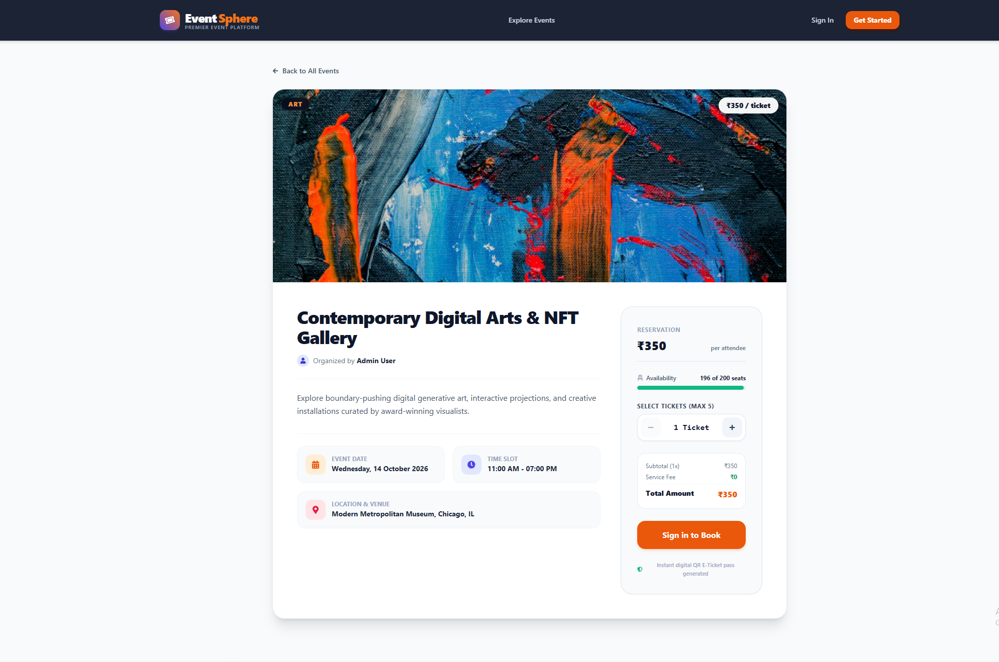
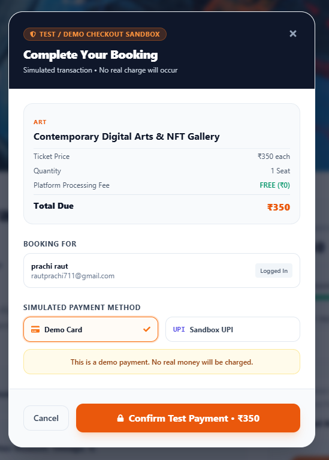
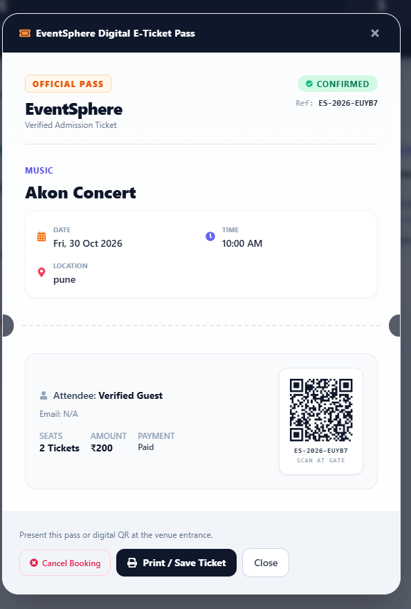
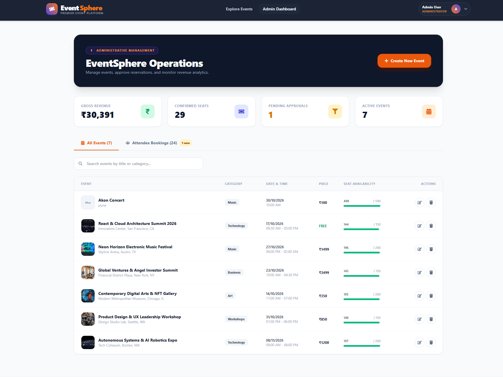
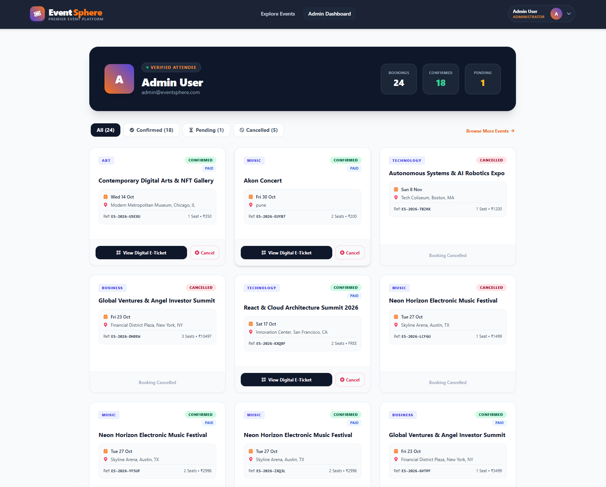

# EventSphere

A full-stack event discovery and ticket booking platform built with React, Node.js, Express, and MongoDB.

**Live Demo:** Coming soon

## Tech Stack

* **Frontend:** React 19, Vite, Tailwind CSS, React Router, Axios
* **Backend:** Node.js, Express
* **Database:** MongoDB, Mongoose
* **Authentication:** JWT, bcryptjs, email OTP
* **Other:** Nodemailer, QR code generation

## Features

* Browse, search, filter, and sort events.
* Register and verify accounts using email OTP.
* Book multiple tickets with dynamic price calculations.
* Generate digital e-tickets with QR codes.
* View and cancel bookings.
* Manage events and approve bookings through the admin dashboard.
* Track event capacity, bookings, and revenue.

## Screenshots

### Home Page



### Event Details



### Demo Checkout



*Demo checkout only. No real money is charged.*

### Digital E-Ticket



### Admin Dashboard



### Booking Management



## Run Locally

**Requirements:** Node.js, npm, and MongoDB.

### 1. Clone the repository

```bash
git clone https://github.com/prachiraut711/Event-Booking-Web-App.git
cd Event-Booking-Web-App
```

### 2. Install dependencies

```bash
cd server
npm install

cd ../client
npm install
```

### 3. Configure environment variables

Create `server/.env` using `server/.env.example`, and `client/.env` using `client/.env.example`.

Configure your MongoDB connection, JWT secret, email settings, and frontend API URL. Never commit real credentials.

For local development, set the frontend API URL to:

```env
VITE_API_URL=http://localhost:5000/api
```

### 4. Seed sample data

From the `server` directory, run:

```bash
node seed.js
```

Review the seed script before running it against any database containing data you want to preserve.

### 5. Start the application

In one terminal, from the `server` directory:

```bash
npm run dev
```

In another terminal, from the `client` directory:

```bash
npm run dev
```

Open `http://localhost:5173` in your browser.

## Payment Notice

EventSphere uses a simulated checkout flow for demonstration purposes. It does not charge real money or use a live payment gateway.

## Author

**Prachi Raut**

[GitHub](https://github.com/prachiraut711) · [Project Repository](https://github.com/prachiraut711/Event-Booking-Web-App)
